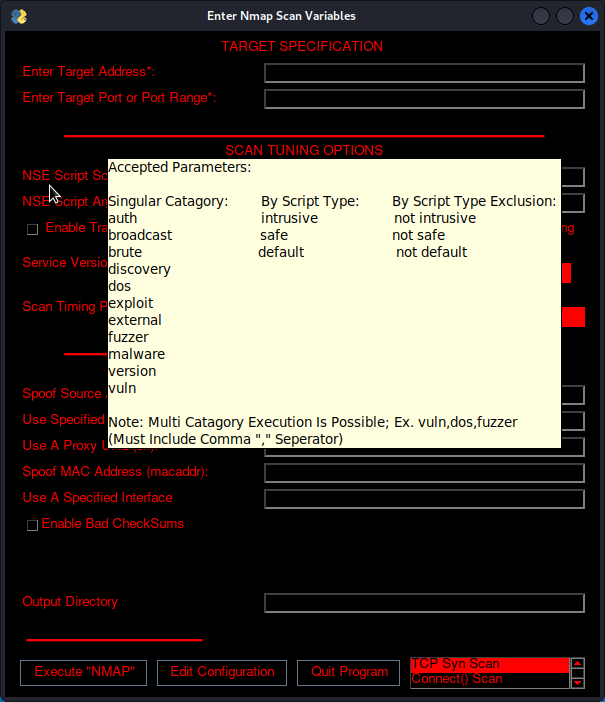

# ASADT | Assistive Search And Discovery Tool
> Version: 2.0.0 (PRE-RELEASE) <br>
> Last Update: September 28th, 2023 <br>
> [KaliOS](https://www.kali.org) & [ParrotOS](https://www.parrotsec.org) Compatible


# ***MAJOR UPDATES***
ASADT has undergone a **COMPREHENSIVE OVERHAUL**. This revision entails a complete reconfiguration of the codebase, introducing a class-based and function-oriented architectural paradigm. Furthermore, we owe our gratitude to the collaborative efforts of the *BlackBox Computer Security Research And Development Team*, whose valuable insights have driven substantial transformations in the script's structural composition.

Through this extensive revision, we have substantially streamlined the accessibility and modifiability of the project, thereby facilitating active participation and contributions from the open-source community.

*With joyous enthusiasm, we introduce Version 2.0.0 of ASADT!*

## Project Description

ASADT (Assistive Search And Discovery Tool) is a powerful Python script designed to enhance the usability and functionality of the [Kali Linux](https://www.kali.org) and [Parrot Linux](https://www.parrotsec.org) Compatible operating systems. It provides a comprehensive toolkit and graphical user interface (GUI) that simplifies the execution of various programs and scripts.

With ASADT, you no longer need to manually type lengthy commands or remember complex argument structures. The script streamlines the process of interacting with tools and scripts, enabling you to focus on analyzing and attacking your target without getting bogged down by technicalities.

### Key features of ASADT:

- **NEW: ToolTip Help View**: ASADT offers a tooltip view for each input value, viewable by hovering over any text field! Try it out now in release version 1.0.6!



- **NEW: Command Generation**: ASADT now generates commands based on user input, allowing for a more advanced execution ability! (NOTE: This is a beta feature and may not properly operate. Report any issues [here](https://github.com/odf-community/ASADT3/issues))

- **User-Friendly Toolkit**: ASADT incorporates a GUI frontend, powered by [PySimpleGUI](https://github.com/PySimpleGUI/PySimpleGUI), that guides users through the process of configuring and executing programs and scripts. This intuitive interface eliminates the need for extensive command-line knowledge and enhances overall user experience.

- **Flexible Configuration**: The script allows users to customize and configure various parameters for each program or script. By interacting with the GUI, users can easily input the required data and tailor the execution according to their specific needs.

- **Module-Based Structure**: ASADT adopts a modular structure, organizing tools and scripts into different modules. This categorization enhances the organization and accessibility of the available utilities, making it easier for users to find the tools they need.

- **Automatic Updates**: ASADT includes a built-in update checking mechanism. By downloading the newest ScriptInfo configuration, the script ensures that users always have the latest versions of tools and scripts, providing access to the most up-to-date features and bug fixes.

ASADT is an invaluable asset for both beginner and experienced security professionals. Its user-friendly approach empowers users to leverage the full potential of the tools and scripts within Kali Linux and Parrot Linux, facilitating efficient and effective security assessments.

## Requirements

There are two methods to install ASADT's required modules:

1. **Setup Script**: Execute the [`setup.sh`](setup.sh) script by running the following command:

````
sudo bash setup.sh
````

2. **Package Installation**: Use pip to install the required packages listed in [`requirements.txt`](requirements.txt). Run the following command:

````
sudo pip install -r requirements.txt
````

> Notice: ASADT MK 3 requires APT packages generally found in KaliOS & ParrotOS <br>
> If changing your operating system is not an option, We suggest you consider use <br>
> of [KaliOS's Docker](https://hub.docker.com/search?q=kalilinux&operating_system=linux%2Cwindows&architecture=arm%2Carm64%2Camd64) Lightweight Images. <br> <br>
> Required APT Packages (As Of Version 1.0.0): <br>
> apt, python3, python3-pip, nmap, nikto


## Usage
To utilize ASADT, execute the following command:

````
sudo ./asadt.py --help

usage: asadt.py [-h] [--scantool] [--tools] [--updatechk] [-v] [--version] [tool_name ...]

positional arguments:
  tool_name    Utility/Script To be Executed (Used In Conjunction With --module_name)

options:
  -h, --help   show this help message and exit
  --scantool   Selects (tool_name) In The 'scantool' Module For Execution
  --tools      List Available Tools By Module Name
  --updatechk  Checks For Updates By Downloading The Newest ScriptInfo Configuration
  -v           Shows Program Version With Our Cool Banner :)
  --version    Show Program's Version Number + Name
````

To execute a tool (or module:submodule pair) using ASADT, execute the following command:

````
sudo ./asadt.py -{module_name} {tool_name}

Ex: sudo ./asadt.py --scantool nmap
Ex: sudo ./asadt.py --scantool nikto
````

The 1st command above will display the help menu, which provides a comprehensive list of available options and functionalities. Refer to the help menu for detailed instructions on using ASADT effectively.

> Please Note: It is recommended to run ASADT with administrative privileges (`sudo`) to ensure proper execution of certain tools and scripts. However, it is possible to prevent ASADT from requesting these permissions. If you would like to utilize this option, it is available by executing `asadt.py` without the `sudo` flag and following the on-screen instructions. It is worth mentioning that Python modules that are installed using the `pip install -r requirements.txt` are place in the local account of execution. It is suggested to install these packages both as a root user and as a local user if you chose to utilize the `sudo disengage` option, due to changes in `site-packages` area when executing as 2 different parties.

For any issues, feedback, or feature requests, please refer to the [GitHub Discussions Channel](https://github.com/odf-community/ASADT3/discussions) or the [GitHub Issues Channel](https://github.com/odf-community/ASADT3/issues) and create an issue. We welcome contributions and collaboration from the open-source community to enhance ASADT and make it even more robust and user-friendly.